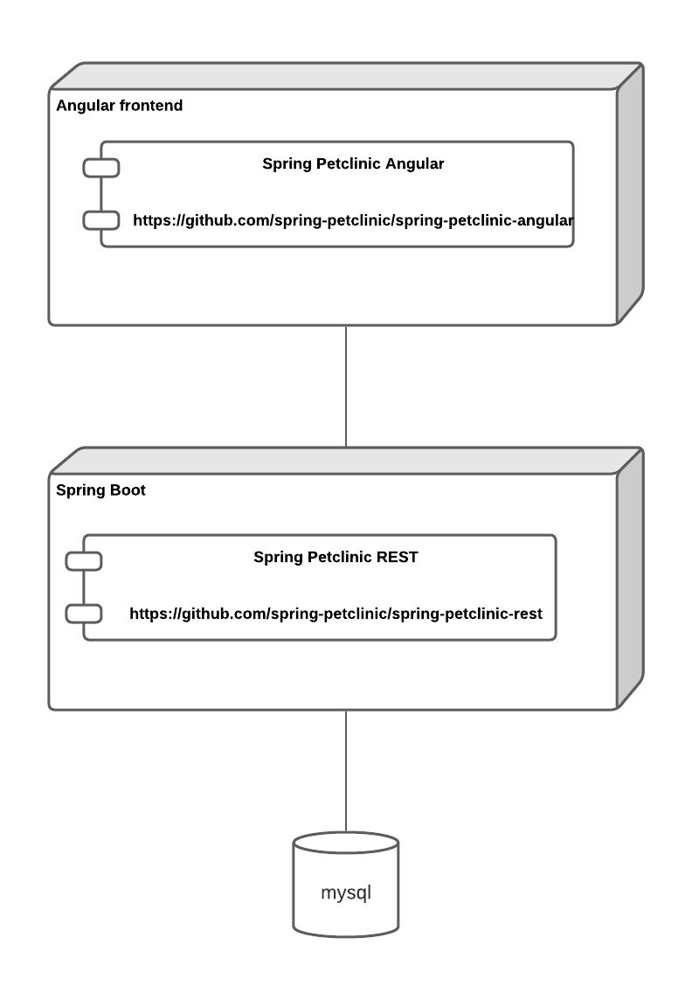
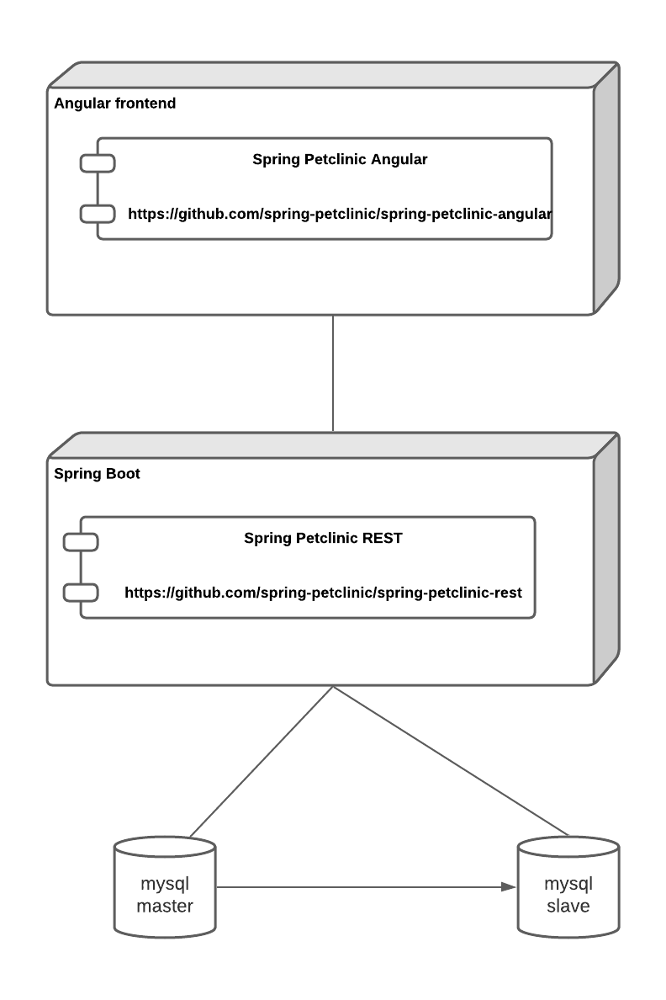
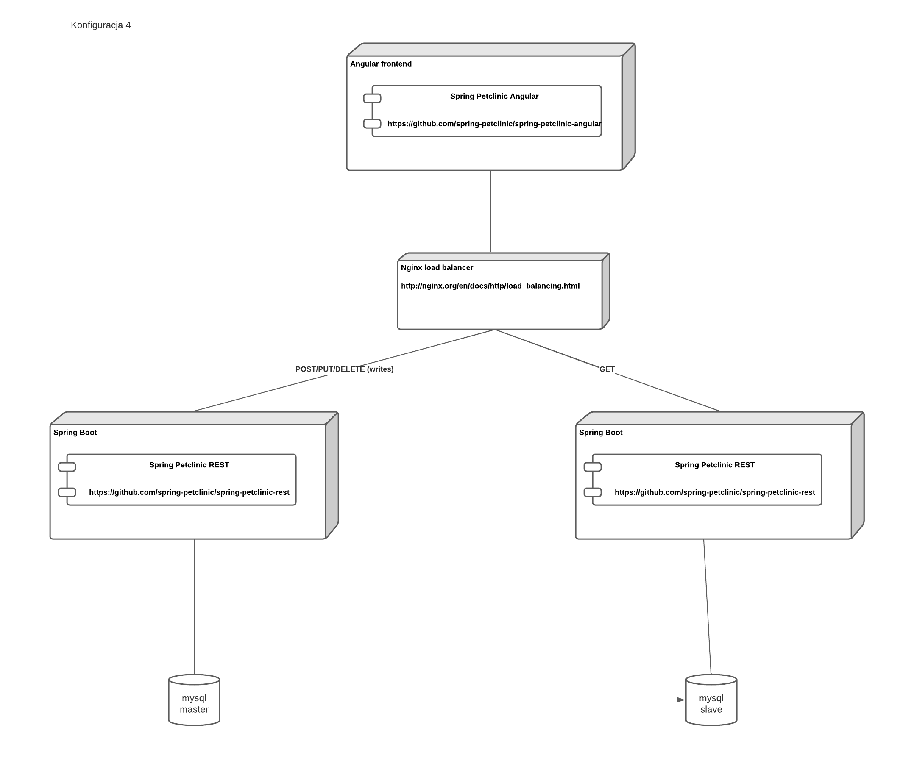

# Lab 1

## Polecenie

Napisać skrypt w bashu, który wykona deployment aplikacji Spring Petclinic, na maszynach
wirtualnych infrastrukturze Azure z frontendem w Angularze i bazą danych mysql. Deployment
powinien być na "gołych" maszynach wirtualnych, bez konteneryzacji.

[Repozytorium frontendu](https://github.com/spring-petclinic/spring-petclinic-angular)  
[Repozytorium backend](https://github.com/spring-petclinic/spring-petclinic-rest)

### Założenia

1. proszę skorzystać z usług w modelu IaaS (tzn z czystych maszyn wirtualnych)
2. każdy element infrastrukturalny powinien działać na dedykowanej maszynie wirtualnej
3. skrypt powinien wykonać wszystkie kroki potrzebne do zbudowania, zainstalowania i
uruchomienia aplikacji na "czystych" maszynach wirtualnych
4. skrypt musi umożliwić parametryzowanie miejsc deploymentu oraz portów na których będą
dostępne poszczególne elementy
5. w szczególności musi być możliwość deploymentu przy użyciu przygotowanego skryptu
wszystkich komponentów na jednej VM lub każdy komponent na dedykowanej VM (albo
dowolna kombinacja)
6. ruch może być zrealizowany po protokole http (bez szyfrowania)
7. można się posługiwać adresami ip lub nazwami serwerów w Azure
8. skrypty powinien być umieszczone w uczelnianym repozytorium gitlab
9. pożądana jest przejrzystość skryptów, właściwa strukturalizacja itd.
10. można korzystać z plików deploymentu [ARM templates](https://docs.microsoft.com/en-us/azure/azure-resource-manager/templates/)
11. nie należy korzystać z konteneryzacji
12. proszę zaprojektować odpowiednią strukturę sieci, tak żeby komponenty backendowe (serwer aplikacyjny, baza danych) były w podsieci wewnętrznej a jedynie serwer www/load
balancer/reverse proxy było widoczne na zewnątrz

Konfiguracja powinna być parametrem skryptu.  

### Zakres projektu

Podstawowy zakres projektu: wykonanie wszystkich czynności opisanych w punkcie 1 założeń.

Zakres opcjonalny:

- automatyczna weryfikacja poprawności kolejnych faz wdrażania i czytelne komunikowanie
ewentualnych błędów. Przykładowo: zaczynamy od instalacji JVM w określonej wersji. Jeżeli
ten krok się nie powiedzie, to uruchamiający skrypt powinien zobaczyć adekwatny komunikat.
- automatyczny test uruchomionej aplikacji
- przechowywanie haseł w usłudze Azure Key Vault

### Konfiguracje

1. Konfiguracja podstawowa



2. Konfiguracja z replikacją master-slave bazy danych

[Replikacja MySQL](https://dev.mysql.com/doc/refman/8.0/en/replication.html)



3. Konfiguracja z replikacją master-slave bazy danych i load balancerem



## Raport

### Uruchomienie programu

```bash
chmod +x ./deploy_script.sh
./deploy_script.sh configs/configX.json
```

### Tworzenie nowej konfiguracji (innej niż 1, 3, 4)

Należy w folderze configs utworzyć nowy plik .json.  
Do konfiguracji można wykorzystać już istniejące nazwy serwisów, wtedy zostaną użyte stworzone przez nas skrypty.  
Jeśli konfiguracja serwisu nie jest odpowiednia do zadania, należy utworzyć folder commands/service_name i w nim plik commands.json z konfiguracją serwisu.  
Wszystkie możliwe pola plików konfiguracyjnych zostały przedstawione w przykładowych konfiguracjach.

### Opis ogólny

Nasze rozwiązanie opiera się na plikach konfiguracyjnych w folderze config. Według jego konfiguracji są tworzone zasoby w serwisie Azure, a następnie na maszynach wirtualnych są uruchamiane serwisy z parametrami zamieszczonymi w pliku.

### Usługa Azure

Zasoby w serwisie Azure są tworzone w kolejności grupa -> sieć wirtualna -> grupy nsg -> zasady grup nsg -> podsieci -> publiczne adresy ip -> maszyny wirtualne. Po stworzeniu wszystkich maszyn wirtualnych i uruchomieniu na nich serwisu usuwane są zasady grup nsg pozwalających na łączenie się z maszynami wirtualnymi po ssh. Aby uruchomić serwisy na maszynach wirtualnych łączymy się z nimi po ssh. Aby to osiągnąć, każdej z maszyn przed połączeniem udzielamy publiczny adres ip temp_ip, a po uruchomieniu wszystkich serwisów na tej maszynie, zwalniamy go. Szczegółowe wyniki każdej z operacji są wpisywane do logów.

### Skrypty serwisów

Dla każdy z typów serwisów (backend, baza danych bez replikacji, baza danych master, baza danych slave, frontend, load balancer) jest podfolder w folderze commands. Każdy z takich podfolderów zawiera plik commands.json oraz dodatkowe skrypty. Gdy uruchamiany jest serwis, łączymy się z VM po ssh, a następnie po kolei uruchamiamy na wirtualnej maszynie komendy z pliku commands.json. Bardziej skomplikowane polecenia znajdują się w skryptach, dla których jest możliwość podawania parametrów przekazanyh z pliku config. Wyniki każdej z komend działania programu są wpisywane do logów.

**Bazy danych**

Aby uruchomić bazę danych bez replikacji pobieramy aktualizacje oraz pakiety mysql-server i wget. Następnie wpisujemy rzeczywiste parametry do pliku mysqld.cnf. Potem tworzymy odpowiednich użytkowników, pobieramy i uruchamiamy skrypty tworzące i zapełniające bazę danych i uruchamiamy serwis mysql.

Baza danych master jest tworzona bardzo podobnie, tyle że tworzymy dodatkowego użytkownika slave_user i dajemy mu prawo do replikacji.

Baza danych slave także jest tworzona podobnie, tylko że przed uruchomieniem serwisu mysql ustawiamy na mastera utworzoną wcześniej bazę master i zaczynamy replikację

**Backend**

Aby uruchomić backend zaczynamy od aktualizacji pakietów, zainstalowania Javy i pobrania repozytorium backendu. Następnie wpisujemy do plików konfiguracyjnych aplikacji rzeczywiste parametry. Następnie definiujemy nowy system service odpowiadający za uruchomienie naszej aplikacji i uruchamiamy go.

**Load balancer**

Po pobraniu niezbędbych pakietów tworzymy plik konfigurujący działanie load balancera dla naszych parametrów i uruchamiamy nginxa

**Frontend**

Po pobraniu wszystkich niezbędnych pakietów, repozytorium aplikacji, a także zainstalowaniu NodeJS, Angular CLI i app dependencies, wpisujemy do pliku konfiguracyjnego aplikacji nasze dane i budujemy aplikację. Następnie konfigurujemy w ngixie serwer sieciowy i uruchamiamy go.
