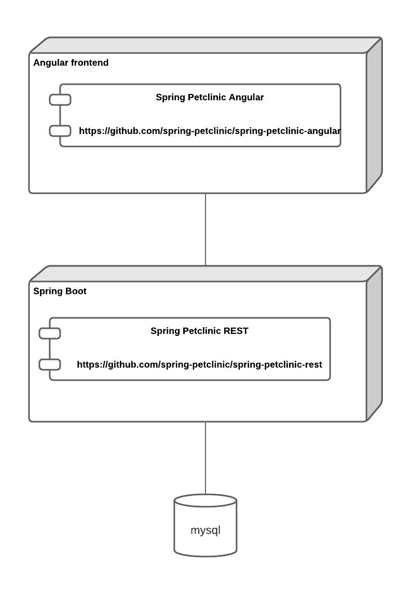
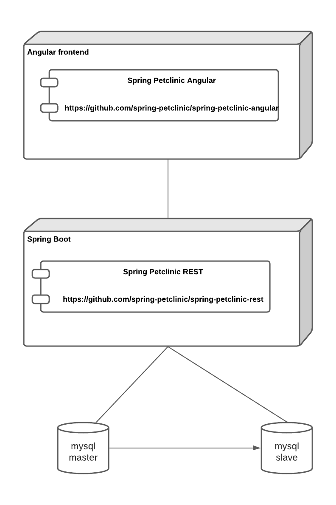
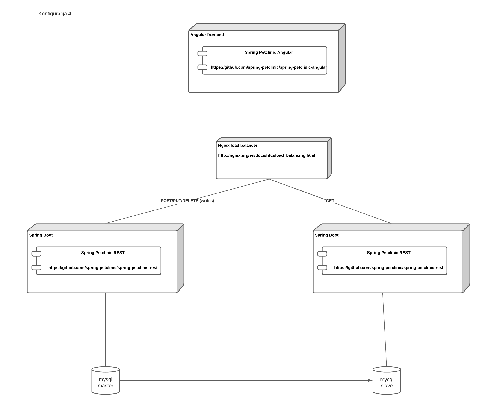

# Lab 2

## Polecenie

Napisać skrypt ansible, który wykona deployment aplikacji Spring Petclinic, na maszynach wirtualnych infrastrukturze Microsoft Azure z frontendem w Angularze i bazą danych mysql

[Repozytorium frontendu](https://github.com/spring-petclinic/spring-petclinic-angular)  
[Repozytorium backend](https://github.com/spring-petclinic/spring-petclinic-rest)

### Założenia

1. poszczególne komponenty aplikacji mogą być pakowane w kontenery
2. skrypt musi umożliwić parametryzowanie miejsc deploymentu oraz portów na których będą dostępne poszczególne elementy
3. w szczególności musi być możliwość deploymentu przy użyciu przygotowanego skryptu wszystkich komponentów na jednej VM lub każdy komponent na dedykowanej VM (albo dowolna kombinacja)
4. można się posługiwać adresami ip lub nazwami serwerów
5. skrypty powinien być umieszczone w uczelnianym repozytorium gitlab
6. pożądana jest przejrzystość skryptów, właściwa strukturalizacja itd.
7. Węzeł master ansible może działać na jednej z maszyn w Azure lub na maszynie lokalnej - do decyzji Autorów
8. można korzystać z konteneryzacji

Konfiguracja powinna być parametrem skryptu.  

### Zakres projektu

Podstawowy zakres projektu: wykonanie wszystkich czynności opisanych w punkcie 1 założeń.

Zakres opcjonalny:

- automatyczna weryfikacja poprawności kolejnych faz wdrażania i czytelne komunikowanie ewentualnych błędów. Przykładowo: zaczynamy od instalacji JVM w określonej wersji. Jeżeli ten krok się nie powiedzie, to uruchamiający skrypt powinien zobaczyć adekwatny komunikat.
- automatyczny test uruchomionej aplikacji
- przechowywanie haseł w usłudze [Azure Key Vault](https://azure.microsoft.com/pl-pl/services/key-vault/)

### Konfiguracje

1. Konfiguracja podstawowa



2. Konfiguracja z replikacją master-slave bazy danych

[Replikacja MySQL](https://dev.mysql.com/doc/refman/8.0/en/replication.html)



3. Konfiguracja z replikacją master-slave bazy danych i load balancerem



## Raport

### Konfiguracja środowiska

Wymagana wersja Pythona <=3.11

```bash
python3 -m venv .venv
source .venv/bin/activate
pip3 install --upgrade pip
pip3 install wheel ansible
ansible-galaxy collection install azure.azcollection
pip3 install -r ~/.ansible/collections/ansible_collections/azure/azcollection/requirements-azure.txt
```

### Uruchomienie programu

Program został podzielone na dwie częsci odpowiadające za, kolejno:

- Utworzenie zasobów Azure i maszyn wirtualnych
- Konfigurację komponentów aplikacji Petclinic na maszynach

Części można uruchamiać według potrzeb (np. do aktualizacji kodu wystarczy wykonanie kroku 2.)  
X oznacza numer konfiguracji

#### Krok 1 - Tworzenie zasobów

```bash
ansible-playbook vm_creation.yml -i inventories/inventoryX.yml
```

#### Krok 2 - Konfiguracja

```bash
ansible-playbook deploy.yml -i inventories/inventoryX.yml -i azure_rm.yml
```

Oba kroki na raz można wykonać za pomocą polecenia `./fullDeploy.sh X`

### Opis ogólny

Projekt zakłada stworzenie skryptów ansible, które automatyzują proces wdrożenia aplikacji na infrastrukturze Microsoft Azure. Zarządzanie konfiguracją i infrastrukturą jest w pełni zautomatyzowane przy użyciu playbooków ansible, które zarządzają cyklem życia zasobów w chmurze, od tworzenia sieci i maszyn wirtualnych po wdrożenie aplikacji w kontenerach docker. Skrypty wykorzystuje modułowość ansible, definiując role i zadania w celu konfiguracji i uruchomienia komponentów aplikacji, które są konteneryzowane przy użyciu docker. Użycie konteneryzacji pozwoliło na elastyczne zarządzanie komponentami aplikacji. Wykorzystując mechanizm dynamicznego inwentarza ansible, skrypty automatycznie identyfikują i konfigurują zasoby w chmurze. Proces ten jest inicjowany lokalnie.

### Ogólny cykl działania całego programu

Projekt rozpoczyna się od konfiguracji środowiska lokalnego. Inicjując wdrożenie tworzone są zasoby w azure, w tym sieci, podsieci, maszyny wirtualne i ich konfiguracje za pomocą odpowiednich playbooków. Po skonfigurowaniu infrastruktury, kolejny etap obejmuje budowanie obrazów docker dla poszczególnych komponentów aplikacji wykorzystując odpowiednie dockerfile. Te obrazy są następnie wdrażane na przygotowanych wcześniej maszynach wirtualnych. Kontenery są uruchamiane na odpowiednich maszynach wirtualnych z konfiguracją sieciową, która umożliwia komunikację między serwisami oraz dostępność aplikacji z internetu

### Struktura projektu

- docker-compose-tests - zawiera pliki konfiguracyjne do testowania konteneryzacji lokalnie.
- inventories - pliki .yml definiujące grupy hostów w różnych środowiskach.
- roles - zawiera różne role ansible, które definiują zadania dla poszczególnych komponentów aplikacji, takich jak backend, frontend, baza danych itp.
Każda z tych roli ma własne struktury katalogów:
- files - zawiera pliki dockerfile, które są potrzebne do budowy obrazów kontenerów.
- tasks - zawiera definicje zadań (tasks)ansible, które służą do konfiguracji i wdrożenie kontenera docker

Pliki konfiguracyjne ansible:

- azure_rm.yml - zawiera definicję dynamicznego inwentarza dla ansible
- deploy.yml - inicjuje konfigurację środowiska. Aktualizuje i instaluje wymagane pakiety na maszynach wirtualnych azure, w tym docker i jego zależności.
- vm_creation.yml: Ten plik zawiera playbook ansible do tworzenia zasobów infrastruktury w Azure.

### Parametryzacja i konfiguracja

Konfiguracja umożliwia parametryzowanie kluczowych aspektów wdrożenia, takich jak publiczne adresy ip, porty, i szczegółowe ustawienia środowiskowe dla komponentów aplikacji. Obejmuje to między innymi adresy ip backendu i bazy danych, porty, na których będą one dostępne, oraz dane uwierzytelniające dla bazy danych. Aby stworzyć nową konfigurację dopasowaną do specyficznych potrzeb, wystarczy utworzyć lub zmodyfikować plik konfiguracyjny w folderze inventories i zdefiniować w nim kluczowe parametry.

### Wdrożenie Aplikacji

Pliki main.yml z folderu tasks, obejmują następujące zadania:
Rejestrację zmiennych środowiskowych specyficznych dla odpowiedniego komponentu. Tworzenie potrzebnych katalogów. Kopiowanie plików dockerfile i innych zasobów do odpowiedniego katalogu. Budowanie obrazu docker z użyciem odpowiednich argumentów i zmiennych środowiskowych. Wdrażanie kontenera docker z przekierowaniem odpowiednią konfiguracją sieciową.
